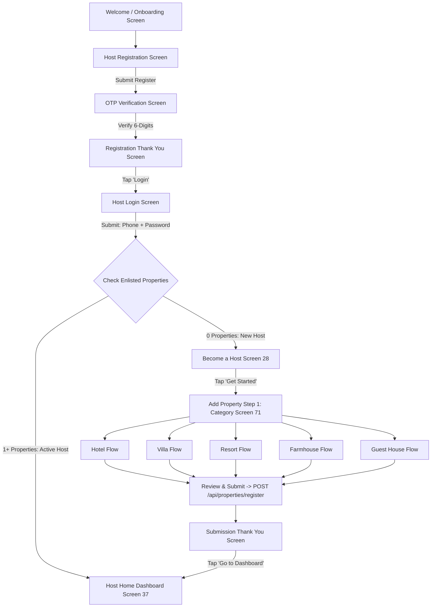

# 🌟 Zaatra - Multi-Role Transportation & Stay Platform

**Zaatra** is an all-in-one Flutter application integrating **Stays & Hospitality Management**, **Ride Booking**, and **Driver Onboarding** into a unified mobile experience. The platform features an intelligent role-routing architecture for **Hosts**, **Customers**, and **Drivers** powered by a **Node.js / Express / MongoDB Atlas** backend.

---

## 📌 Table of Contents
1. [Key Features](#-key-features)
2. [Architecture & Flow](#-architecture--flow)
3. [5 Dedicated Property Enlistment Flows](#-5-dedicated-property-enlistment-flows)
4. [Tech Stack](#-tech-stack)
5. [Directory Structure](#-directory-structure)
6. [Getting Started & Setup](#-getting-started--setup)
7. [API Endpoints Reference](#-api-endpoints-reference)
8. [Building the APK](#-building-the-apk)

---

## 🚀 Key Features

### 🏨 1. Host Ecosystem & Property Management
* **5 Dedicated Property Categories**: Tailored 9-step registration flows for **Hotel**, **Villa**, **Resort**, **Farmhouse**, and **Guest House**.
* **Dynamic Media & KYC Documents Upload (Step 9)**:
  * **Photos**: JPEG / PNG multi-photo selector with live `5/5` counter and delete controls.
  * **KYC Documents**: PDF / PNG / JPEG support for *Ownership Proof*, *Identity Proof*, *Tax Registration*, and *NOC / Clearances*.
* **Intelligent Enlistment Routing**:
  * **New Hosts (0 Properties)**: Automatically guided to **Become a Host** ➔ **Add Property Wizard**.
  * **Active Hosts (1+ Properties)**: Directly routed to the **Host Home Dashboard**.
* **Host Home Dashboard**: Full analytics with total earnings, occupancy rates, property listings, bookings, reviews, and a floating **`+ Add Property`** action button.

### 🔐 2. Authentication & Role System
* **Mobile Number + Password Login**: Clean direct credential validation.
* **Registration & OTP Flow**: User registration ➔ 6-digit OTP verification ➔ Registration Thank You screen ➔ Login.
* **Intelligent Role Routing**: Automatically directs users to their respective host, customer, or driver experience without redundant role selection prompts.

### 🚗 3. Driver & Customer Ecosystems
* **Driver Onboarding**: Personal KYC verification (Aadhar, PAN, Driving License) and vehicle onboarding (RC book, insurance, fuel type).
* **Customer Experience**: Stays search, real-time database property listings, map location selector, date filters, and booking confirmation.

---

## 🧭 Architecture & Flow



---

## 🏝️ 5 Dedicated Property Enlistment Flows

| Property Type | Step 2 (Details) | Step 5 (Amenities) | Step 7 (Pricing) |
| :--- | :--- | :--- | :--- |
| **🌴 Resort** | Cottages/Suites, Swimming Pools, Max Guest Capacity, In-house Restaurants | *Infinity Pool, Buffet Restaurant, Spa & Wellness, Beach Access, Water Slides, Adventure Sports* | All-Inclusive Cottage Rate, Day Pass Rate, Extra Adult Tariff |
| **🚜 Farmhouse** | Farm Acreage (e.g. 2.5 Acres), Event Party Lawn Capacity (150 guests), Bedrooms | *Private Pool, Organic Orchard, Bonfire Pit, Open BBQ & Tandoor, Party Lawn, Cricket Pitch* | Full Farmhouse Overnight Stay Rate, Day-Out / Event Party Lawn Charge, Caution Deposit |
| **🏠 Guest House** | Private Guest Rooms, Attached Bathrooms, Shared Bathrooms, Total Capacity | *Homely Cooked Meals, RO Water, Shared Kitchen, Washing Machine, Geyser, Housekeeping* | Standard Private Room Rate, Entire Guest House Booking Rate, Home Meal Package |
| **🏡 Villa** | Bedrooms, Bathrooms | *Private Pool, Modular Kitchen, Clubhouse, Jacuzzi, BBQ Grill, Home Theatre, Game Lounge* | Flat Price per Night for entire villa + Security deposit |
| **🏨 Hotel** | Multi-Room Category Counters (`Single/Double Regular/Luxury`) | Dual toggle lists: *Luxury Room Amenities* vs *Regular Room Amenities* | Room category tier pricing |

---

## 💻 Tech Stack

### Frontend (Mobile & Web)
* **Framework**: [Flutter](https://flutter.dev/) (SDK `>=3.0.0 <4.0.0`)
* **Language**: [Dart](https://dart.dev/)
* **Design System**: Material Design 3 with custom brand theme
* **Typography**: Google Fonts (`Inter`, `Poppins`)
* **State & Networking**: `provider`, `http`, `shared_preferences`

### Backend
* **Runtime**: Node.js & Express.js
* **Database**: MongoDB Atlas (Mongoose ODM)
* **Authentication**: JWT (JSON Web Tokens) & Bcrypt password hashing
* **Port**: `http://localhost:5000`

---

## 📁 Directory Structure

```
zaatra app/
├── android/                   # Android native project & Gradle build configs
├── assets/                    # Static image assets, illustrations & icons
│   └── images/
├── lib/
│   ├── core/
│   │   ├── constants/         # App colors, styles, string constants
│   │   └── theme/             # Material 3 light/dark theme definitions
│   ├── models/                # Data models (User, Property, Booking)
│   ├── services/
│   │   ├── api_service.dart   # Central HTTP client & Base URL resolver
│   │   ├── auth_service.dart  # Authentication & OTP API client
│   │   ├── host_service.dart  # Property registration & host API client
│   │   └── driver_service.dart# Driver onboarding API client
│   ├── views/
│   │   ├── screens/
│   │   │   ├── auth/          # Login, Registration, OTP, Thank You screens
│   │   │   ├── host/          # Host Dashboard, 5-Category Add Property Wizard
│   │   │   │   ├── common/    # Shared Steps (Address, Desc, Rules, Timings, Step 9 Upload, Review)
│   │   │   │   ├── resort/    # Dedicated Resort Flow (Steps 2, 5, 7)
│   │   │   │   ├── farmhouse/ # Dedicated Farmhouse Flow (Steps 2, 5, 7)
│   │   │   │   ├── guesthouse/# Dedicated Guest House Flow (Steps 2, 5, 7)
│   │   │   │   └── villa/     # Dedicated Villa Flow (Steps 2, 5, 7)
│   │   │   ├── customer/      # Customer Stay search, listings & booking
│   │   │   ├── driver/        # Driver dashboard & rides
│   │   │   └── onboarding/    # Driver personal & vehicle onboarding
│   │   └── widgets/           # Reusable custom buttons, inputs & cards
│   └── main.dart              # Main application entry point
├── pubspec.yaml               # Flutter package dependencies & assets configuration
└── README.md                  # Project documentation
```

---

## ⚙️ Getting Started & Setup

### 1. Prerequisites
* [Flutter SDK](https://docs.flutter.dev/get-started/install) installed and configured in PATH.
* [Node.js](https://nodejs.org/) installed (for running the backend).
* Google Chrome (for web testing) or an Android device/emulator.

### 2. Start the Backend Server
```powershell
cd "C:\Users\Administrator\Desktop\projects\Zaatra_Backend-main"
node src/server.js
```
*Server runs on `http://localhost:5000` connected to MongoDB Atlas.*

### 3. Run the Frontend App

#### Run in Chrome:
```powershell
cd "C:\Users\Administrator\Desktop\projects\zaatra app"
flutter run -d chrome
```

#### Run on Connected Android Device / Emulator:
```powershell
flutter run
```

---

## 📡 API Endpoints Reference

| Category | Method | Endpoint | Description |
| :--- | :--- | :--- | :--- |
| **Auth** | `POST` | `/api/auth/register` | Register new user with role (`host`, `customer`, `driver`) |
| **Auth** | `POST` | `/api/auth/mobile/login-init` | Validate mobile + password and receive OTP / user payload |
| **Auth** | `POST` | `/api/auth/mobile/verify-otp` | Verify 6-digit authentication code |
| **Property** | `POST` | `/api/properties/register` | Register complete 9-step property listing |
| **Property** | `GET` | `/api/properties?hostId={id}`| Fetch properties listed by a specific host |
| **Driver** | `POST` | `/api/driver/register` | Submit driver KYC documents |
| **Driver** | `POST` | `/api/driver/vehicle` | Onboard driver vehicle details |

---

## 📦 Building the Release APK

To compile a standalone production Android APK:
```powershell
flutter build apk --release
```
The compiled binary will be located at:
`build/app/outputs/flutter-apk/app-release.apk`
*(Also copied to project root as `zaatra_host.apk`)*.

