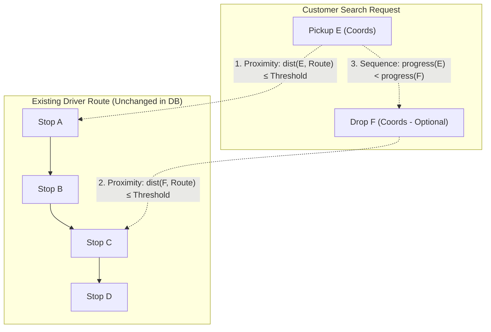

# Doorstep Pickup & Drop: Ride Search & Matching Logic

This document details how the existing ride-search logic handles the **Doorstep Pickup & Drop** requirement **without modifying the backend architecture, database schema, or the driver ride-publishing flow**.

---

## 1. Problem Scenario & Objectives

### Existing Driver Route
A driver publishes a scheduled ride with an ordered sequence of stops/waypoints:
$$\text{Route: } A \longrightarrow B \longrightarrow C \longrightarrow D$$

### Customer Doorstep Search
A customer searches for a journey with doorstep locations:
- **Pickup Location ($E$)**: Located near driver's start/waypoint $A$. (*Mandatory*)
- **Drop Location ($F$)**: Located near driver's waypoint $C$. (*Optional*)

### Expected Behavior
- The search identifies that the driver's existing route ($A \to B \to C \to D$) passes sufficiently close to $E$ and $F$.
- The ride is returned in the search results as a valid match:
  $$E \dots (A \longrightarrow B \longrightarrow C) \dots F$$
- **Driver data remains unmodified**: The driver's original route remains $A \to B \to C \to D$.

---

## 2. Architecture & Matching Flow



---

## 3. Step-by-Step Search Algorithm

```
+-----------------------------------------------------------------------------------+
| 1. Customer Search Request Received                                               |
|    - Pickup Coordinates: (lat_E, lng_E)  [Mandatory]                              |
|    - Drop Coordinates:   (lat_F, lng_F)  [Optional]                               |
|    - Date & Requested Passenger/Seat Count                                        |
+-----------------------------------------+-----------------------------------------+
                                          |
                                          v
+-----------------------------------------------------------------------------------+
| 2. Candidate Pre-Filtering (Broad Phase - Existing DB Query)                     |
|    - Query DB for active rides on requested date with availableSeats >= seats.    |
|    - (Optional) Bounding-box filter around pickup coordinates.                    |
+-----------------------------------------+-----------------------------------------+
                                          |
                                          v
+-----------------------------------------------------------------------------------+
| 3. Route Corridor & Sequence Matching (Narrow Phase)                              |
|    For each candidate driver route [A -> B -> C -> D]:                            |
|                                                                                   |
|    a) Pickup Proximity Check (Mandatory):                                         |
|       - Calculate minimum distance from E to each route segment.                  |
|       - Find closest projection point P_E on the route.                           |
|       - Condition: min_distance(E, Route) <= R_threshold (e.g., 2 to 5 km)       |
|                                                                                   |
|    b) Drop Proximity Check (Only if Drop F is provided):                          |
|       - Calculate minimum distance from F to each route segment.                  |
|       - Find closest projection point P_F on the route.                           |
|       - Condition: min_distance(F, Route) <= R_threshold                          |
|                                                                                   |
|    c) Direction / Sequence Validation (Only if Drop F is provided):               |
|       - Verify that along-route progress of P_E < along-route progress of P_F.    |
|       - Guarantees driver reaches pickup BEFORE drop in the travel direction.     |
|                                                                                   |
|    d) Single Point Matching (If Drop F is omitted):                               |
|       - Condition (a) alone qualifies the ride.                                   |
+-----------------------------------------+-----------------------------------------+
                                          |
                                          v
+-----------------------------------------------------------------------------------+
| 4. Return Search Results                                                          |
|    - Return matched driver rides with original route & metadata.                  |
|    - (Optional) Include nearest boarding & drop point distances.                  |
+-----------------------------------------------------------------------------------+
```

---

## 4. Mathematical Foundations

### 1. Haversine Great-Circle Distance
Given two GPS points $(lat_1, lon_1)$ and $(lat_2, lon_2)$:
$$d = 2 R \arcsin \left( \sqrt{ \sin^2\left(\frac{\Delta lat}{2}\right) + \cos(lat_1) \cos(lat_2) \sin^2\left(\frac{\Delta lon}{2}\right) } \right)$$
*(where $R \approx 6371\text{ km}$ is Earth's mean radius)*

### 2. Cross-Track Distance (Point to Route Segment)
For each line segment $[P_i, P_{i+1}]$ of the driver's route polyline:
1. Project point $E$ perpendicularly onto segment $[P_i, P_{i+1}]$.
2. If projection point $P_E$ lies within the segment boundaries:
   $$\text{distance} = \text{perpendicular distance}(E, [P_i, P_{i+1}])$$
3. If projection falls outside, distance is:
   $$\text{distance} = \min(d(E, P_i), d(E, P_{i+1}))$$
4. Overall route distance:
   $$d_{\min}(E, \text{Route}) = \min_{i} \left( \text{distance}(E, [P_i, P_{i+1}]) \right)$$

### 3. Along-Route Sequence Index
Let $s(E)$ and $s(F)$ represent the normalized distance from the route start ($A$) along the polyline to the projection points $P_E$ and $P_F$:
$$\text{Valid Journey if: } s(E) < s(F)$$

---

## 5. Sample Backend Implementation (Node.js / Express / MongoDB)

The following logic can be added directly into your existing `searchRides` controller:

```javascript
/**
 * Haversine formula to calculate distance between two GPS coordinates in kilometers.
 */
function getHaversineDistanceKm(lat1, lon1, lat2, lon2) {
  const R = 6371; // Earth radius in km
  const toRad = (val) => (val * Math.PI) / 180;
  
  const dLat = toRad(lat2 - lat1);
  const dLon = toRad(lon2 - lon1);
  
  const a =
    Math.sin(dLat / 2) * Math.sin(dLat / 2) +
    Math.cos(toRad(lat1)) * Math.cos(toRad(lat2)) *
    Math.sin(dLon / 2) * Math.sin(dLon / 2);
    
  return 2 * R * Math.atan2(Math.sqrt(a), Math.sqrt(1 - a));
}

/**
 * Finds the closest point on the driver's route and its progress index.
 */
function matchPointToRoute(targetCoords, waypoints, thresholdKm = 3.0) {
  let minDistance = Infinity;
  let bestIndex = -1;

  for (let i = 0; i < waypoints.length; i++) {
    const wp = waypoints[i];
    const dist = getHaversineDistanceKm(targetCoords.lat, targetCoords.lng, wp.lat, wp.lng);
    if (dist < minDistance) {
      minDistance = dist;
      bestIndex = i;
    }
  }

  return {
    isMatch: minDistance <= thresholdKm,
    distanceKm: minDistance,
    progressIndex: bestIndex,
  };
}

/**
 * Search Controller using existing Ride models and route data.
 */
async function searchRides(req, res) {
  try {
    const { pickupCoords, dropCoords, date, passengers } = req.body;
    const requiredSeats = passengers || 1;
    const MAX_DOORSTEP_RADIUS_KM = 3.5; // Configurable threshold

    // 1. Fetch active candidate rides from existing database collection
    const query = {
      status: 'SCHEDULED',
      availableSeats: { $gte: requiredSeats },
    };
    if (date) query.date = date;

    const candidateRides = await Ride.find(query);

    // 2. Perform doorstep corridor and sequence matching
    const matchingRides = candidateRides.filter((ride) => {
      const waypoints = ride.routeWaypoints || [ride.pickup, ...(ride.stops || []), ride.destination];

      if (!waypoints || waypoints.length === 0) return false;

      // Check Doorstep Pickup (Mandatory)
      const pickupMatch = matchPointToRoute(pickupCoords, waypoints, MAX_DOORSTEP_RADIUS_KM);
      if (!pickupMatch.isMatch) return false;

      // If Doorstep Drop is NOT provided, pickup match alone is sufficient
      if (!dropCoords || !dropCoords.lat || !dropCoords.lng) {
        return true;
      }

      // Check Doorstep Drop (Optional)
      const dropMatch = matchPointToRoute(dropCoords, waypoints, MAX_DOORSTEP_RADIUS_KM);
      if (!dropMatch.isMatch) return false;

      // Sequence Check: Pickup must be reached BEFORE Drop in the driver's route
      return pickupMatch.progressIndex < dropMatch.progressIndex;
    });

    return res.status(200).json({
      success: true,
      count: matchingRides.length,
      rides: matchingRides,
    });
  } catch (error) {
    return res.status(500).json({
      success: false,
      message: 'Failed to search rides',
      error: error.message,
    });
  }
}
```

---

## 6. Key Advantages & Compatibility Summary

| Aspect | Status | Why No Architecture Change Is Needed |
| :--- | :--- | :--- |
| **Driver Publishing Flow** | **Unchanged** | Drivers still post standard routes ($A \to B \to C \to D$). |
| **Database Schema** | **Unchanged** | Uses the existing route waypoints / polyline array already stored in the ride record. |
| **API Contract** | **Backward Compatible** | Endpoint accepts coordinates alongside existing text queries; legacy searches function identically. |
| **Drop Location** | **Optional** | Evaluates only pickup proximity if drop coordinates are left empty. |
| **Directional Safety** | **Guaranteed** | Sequence check prevents matching reverse-direction rides. |
